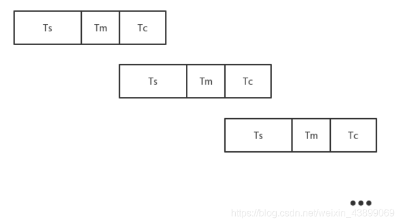
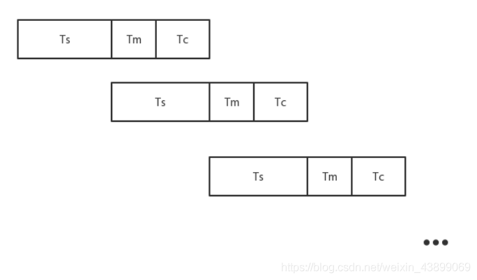

## 问题
假设磁盘块与缓冲区大小相同，每个盘块读入缓冲区的时间为10μs，由缓冲区送至用户区的时间是5μs，系统对每个磁盘块数据的处理时间为2μs。若用户需要将大小为10个磁盘块的Docl文件逐块从磁盘读入缓冲区，并送至用户区进行处理，那么采用单缓冲区需要花费的时间为（ ）μs；采用双缓冲区需要花费的时间为（ ）μs。

## 答案
* 152
  - (10+5)*10+2
* 107
  - 10*10+5+2

## 解析

#### 几组概念：
* 在块设备输入数据的过程中，首先把磁盘数据送到缓冲区，花费的时间为Ts
* 然后把操作系统缓冲区的数据送到用户区，花费的时间为Tm
* 最后用户进程对这批数据进行计算，花费的时间为Tc

#### 单缓冲区公式：
* 由于为单缓冲区，因此Ts 与Tm无法并行，如图：
* 
* 当Ts >Tc
  - 总时间：T总=n*(Ts+Tm )+Tc
* 当Ts <Tc
  - 总时间：T总=n*(Tc+Tm )+Ts

#### 双缓冲区公式：
* Ts过程与Tm可以并行，Tm过程与Tc过程不能并行，如图：
* 
* 当Ts >Tc
  - 总时间：T总=n*Ts+Tm+Tc
* 当Ts <Tc
  - 总时间：T总=n*(Tc+Tm )+Ts
